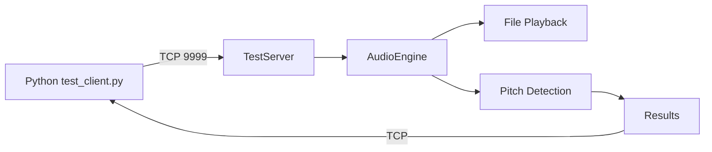

# Test Framework Architecture

## Overview

SuperPitchMonitor uses a unified, cross-platform testing framework based on TCP sockets. This replaces the previous Windows-only named pipe implementation.

## Architecture Components

```
┌─────────────────────────────────────────────────────────────────┐
│                     Test Framework                              │
├─────────────────────────────────────────────────────────────────┤
│                                                                 │
│  ┌──────────────────┐         TCP Socket        ┌─────────────┐ │
│  │  Python Client   │  ◄─────────────────────► │  TestServer │ │
│  │  (test_client.py)│      Port 9999 (default)  │   (C++ )    │ │
│  └──────────────────┘                            └──────┬──────┘ │
│                                                         │        │
│                              ┌──────────────────────────┘        │
│                              ▼                                   │
│                       ┌──────────────┐                          │
│                       │  AudioEngine │                          │
│                       └──────────────┘                          │
│                                                                 │
└─────────────────────────────────────────────────────────────────┘
```

## Communication Protocol

### Message Format

All messages use length-prefixed JSON:

```
[4 bytes: message length (big-endian)] [N bytes: JSON payload]
```

### Command Structure

**Request:**
```json
{
  "cmd": "commandName",
  "param1": value1,
  "param2": value2
}
```

**Response:**
```json
{
  "status": "ok",
  "data": { ... }
}
```

## Available Commands

| Command | Parameters | Description |
|---------|------------|-------------|
| `getStatus` | - | Get current engine status |
| `setMultiRes` | `enabled: bool` | Toggle multi-resolution analysis |
| `loadFile` | `filename: string` | Load audio file from Resources/TestAudio/ |
| `startPlayback` | - | Start audio playback |
| `stopPlayback` | - | Stop audio playback |
| `getPitches` | - | Get list of detected pitches |
| `waitForFrames` | `count: int` | Wait for N processing frames |
| `getSpectrumPeaks` | `freqMin, freqMax` | Get peaks in frequency range |

## Running Modes

### Normal Mode (GUI + TestServer)

```bash
# Windows
./SuperPitchMonitor.exe

# macOS  
./SuperPitchMonitor.app/Contents/MacOS/SuperPitchMonitor

# Linux
./SuperPitchMonitor
```

In normal mode, the application runs with full GUI and TestServer is enabled on port 9999.

### Test Mode (Headless)

```bash
# All platforms
./SuperPitchMonitor -TestMode -TestPort 9999
```

Test mode runs without GUI, suitable for:
- Automated testing
- CI/CD pipelines
- Batch processing

## Python Test Client

### Basic Usage

```bash
# Run all tests
python scripts/test/test_client.py

# Run specific test
python test_client.py --test sine_440

# Custom options
python test_client.py --port 9998 --wait-frames 100
```

### Options

| Option | Description | Default |
|--------|-------------|---------|
| `--port` | TCP port to connect | 9999 |
| `--test` | Filter tests by name | (all) |
| `--timeout` | Connection timeout (seconds) | 30 |
| `--wait-frames` | Frames to wait for analysis | 60 |
| `--exe` | Path to SPM executable | (auto-detect) |
| `--keep-alive` | Keep SPM running after tests | false |
| `--no-launch` | Don't launch SPM | false |

## File Structure

```
Source/Test/
├── TestServer.h          # TestServer class definition
├── TestServer.cpp        # TCP server implementation
└── (AutoTestManager removed)

scripts/test/
├── test_client.py        # Main Python test client
├── README.md            # Test framework documentation
└── (Old Windows scripts removed)
```

## Implementation Details

### C++ Side (TestServer)

**Location:** `Source/Test/TestServer.cpp`

**Key Features:**
- Runs in separate thread
- Thread-safe message handling
- JUCE StreamingSocket for cross-platform compatibility
- Automatic JSON parsing with JUCE classes

**Thread Safety:**
- Main thread: GUI updates, audio processing
- TestServer thread: Socket I/O, command processing
- Protected by CriticalSection for shared data

### Python Side

**Location:** `scripts/test/test_client.py`

**Key Features:**
- Pure Python standard library (no external dependencies)
- TCP socket communication
- Automatic SPM process management
- Ground truth validation

**Dependencies:**
- `socket` - TCP communication
- `json` - Message serialization
- `struct` - Binary data packing
- `subprocess` - SPM process management

## Migration from Old Framework

### What Changed

| Aspect | Old (Windows) | New (Cross-Platform) |
|--------|---------------|----------------------|
| Communication | Named pipes (`\\.\pipe\...`) | TCP sockets (`127.0.0.1:9999`) |
| Windows dep | pywin32 required | Pure Python stdlib |
| Launch param | `-AutoTest` | `-TestMode` |
| Test scripts | Multiple `.bat` and `.ps1` | Single `test_client.py` |
| Platform | Windows only | Windows, macOS, Linux |

### Removed Files

- `Source/Test/AutoTestManager.h`
- `Source/Test/AutoTestManager.cpp`
- Windows-specific test scripts in `scripts/test/`

### Updated Files

- `Source/Main.cpp` - Added `-TestMode` parameter handling
- `Source/MainComponent.cpp` - Integrated TestServer
- `README.md` - Updated testing documentation
- `CMakeLists.txt` - Removed AutoTestManager references

## Testing Workflow



## Future Enhancements

- [ ] WebSocket support for browser-based testing
- [ ] REST API for integration with other tools
- [ ] Performance benchmarking mode
- [ ] Distributed testing across multiple machines
- [ ] Real-time visualization of test progress

## Troubleshooting

### Port Already in Use

```bash
# Find process using port 9999
lsof -i :9999      # macOS/Linux
netstat -ano | findstr 9999  # Windows

# Use different port
./SuperPitchMonitor -TestMode -TestPort 9998
python test_client.py --port 9998
```

### Connection Timeout

Check firewall settings or try longer timeout:
```bash
python test_client.py --timeout 60
```

### Test Audio Not Found

```bash
python scripts/audio/generate_all_tests.py
```
